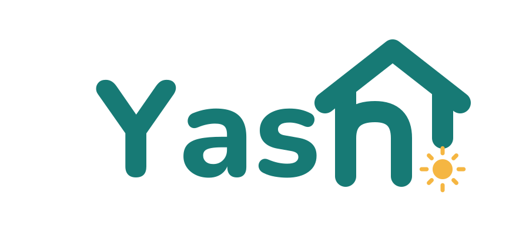
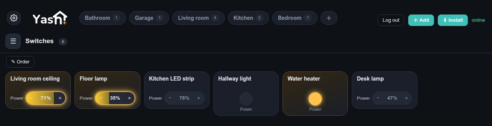
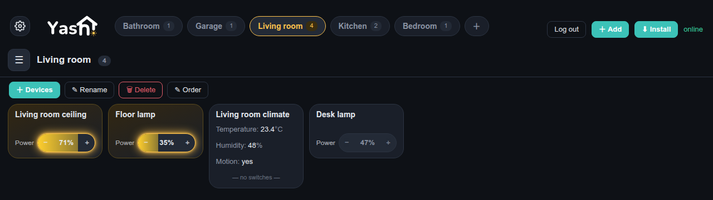
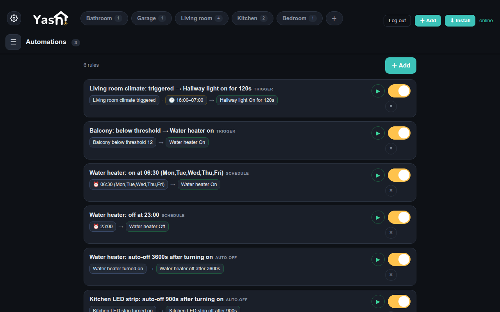
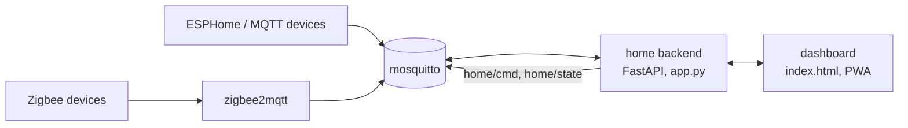
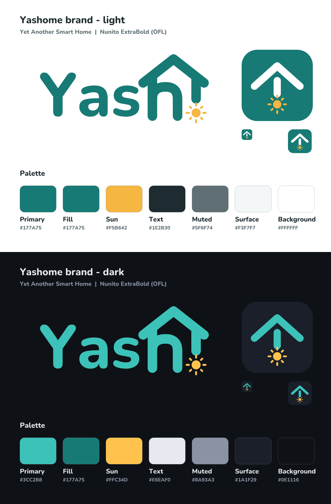

<p align="center"></p>

# Yashome -- Yet Another Smart Home

A small, local-only smart home: one Python backend, one HTML dashboard, MQTT in the middle.
Zigbee devices come in through [zigbee2mqtt](https://www.zigbee2mqtt.io/); anything else that
can speak MQTT (ESPHome nodes, Tasmota, your own firmware) is a few lines of JSON.

No cloud, no accounts, no app store. The dashboard is a web page that installs as a PWA on a
phone or runs full-screen on any old tablet. Rules, schedules and auto-off timers are edited
in the same page.



## Why another one

| | Yashome | Home Assistant and friends |
|---|---|---|
| size | one `app.py`, one `index.html`, two or three containers | a platform with thousands of integrations |
| how a device gets in | it publishes to MQTT; Zigbee devices appear by themselves | integration per vendor, config flow, YAML packages |
| automations | trigger, condition, action; schedule and auto-off per channel, all in the UI | scripts, blueprints, templates |
| what it takes to read the code | an evening | weeks |
| what it does not do | no vendor clouds, no voice assistants, no energy dashboards, no add-on store | everything |

If you already run Home Assistant and like it, keep it. This project is for people who want a
home they can read end to end, on a Raspberry Pi or an old laptop, with a broker they own.

## Features

- **Devices from MQTT.** zigbee2mqtt devices are discovered from the broker's retained topics:
  switches, dimmers, sensors, remotes, locks. Generic MQTT devices are declared in
  `mqtt_devices.json` with their state and command topics.
- **Universal command bus.** Every device is reachable as `home/cmd/<device>/<code>` and
  reports on `home/state/<device>/<code>`, whatever it speaks underneath. Scripts and other
  tools only need this one contract.
- **Rules without code.** A rule is a trigger (device event, time, sensor threshold), optional
  conditions and actions. Per channel: schedules ("on at 06:00 on weekdays") and auto-off
  ("switch off 60 minutes after any on"), including a manual press.
- **Rooms and favourites.** The dashboard groups by room, keeps a favourites strip, shows live
  state over a WebSocket and re-syncs itself if the broker restarts.
- **Renaming that sticks.** Rename a Zigbee device from the dashboard and every rule and
  favourite that referenced it follows.
- **PWA.** Installs on Android and desktop, works offline for the shell, full-screen on a wall
  tablet.
- **Token-gated API.** Everything under `/api` and `/ws` requires a bearer token; without one
  configured the backend refuses every request (fail closed).





## Quick start

### Requirements

Any Linux box that runs Docker: a Raspberry Pi 4 (2 GB is plenty), a NUC, an old laptop. On the
host you need only:

| package | why |
|---|---|
| `docker` + the `compose` plugin (v2) | the three services run as containers; nothing else is installed on the host |
| `git`, `make` | to fetch the repository and run the four commands |
| `curl`, `openssl` | the installer generates secrets with them, the smoke test checks the backend |

Ubuntu 24.04+: `sudo apt install git make curl openssl docker.io docker-compose-v2`. Debian and
Raspberry Pi OS do not package the compose plugin: install `git make curl openssl` with apt and
Docker itself with `curl -fsSL https://get.docker.com | sh` (it brings the plugin). Then add
yourself to the docker group (`sudo usermod -aG docker $USER`, log out and in). Other distros:
[Docker's install guide](https://docs.docker.com/engine/install/). No web server, no Python,
no Node on the host: the backend and its dependencies live in the `home` image, the dashboard
is served by the backend itself. A reverse proxy (nginx, Caddy, Traefik) is optional and only
needed for HTTPS and access from outside the LAN, see `docs/security.md`.

For Zigbee you need a coordinator stick supported by zigbee2mqtt (Sonoff ZBDongle-E/P, SLZB-06
and the like). The example config uses the `ember` adapter (Silicon Labs chips); for a TI-based
stick such as the ZBDongle-P set `adapter: zstack` in `config/zigbee2mqtt/configuration.yaml`. Without one the stack still runs with generic MQTT devices only.

`make check` verifies all of the above and changes nothing.

### Install

```sh
git clone https://github.com/freidkin-michael/yashome.git
cd yashome
make check       # can this host run it? docker, ports, the coordinator stick
make install
```

`make install` writes `.env` for you, creates the broker accounts, starts the containers (the broker,
the backend and, with a stick, zigbee2mqtt)
and prints the dashboard URL together with the token to paste into it. It asks only what it
cannot find out itself. Pair Zigbee devices from the zigbee2mqtt frontend on `:8080`; they show
up on the dashboard within seconds. Generic MQTT devices go into `mqtt_devices.json`;
`examples/` has a relay, a sensor and a dimmable lamp to copy from; the example settings add
rooms, a favourite and two schedules that start disabled.

### What `make install` does, and how to change it later

All settings live in one file, `.env`, and nothing else has to be edited to get a working
system. The installer fills it in like this:

1. **`DASHBOARD_TOKEN`**, **`MQTT_PASSWORD`**, **`MQTT_Z2M_PASSWORD`**, **`Z2M_AUTH_TOKEN`** are
   generated with `openssl rand`. The token is printed once at the end; the broker passwords
   are never shown, `make secrets` writes them straight into the broker's password file and
   zigbee2mqtt's `secret.yaml`.
2. **`Z2M_SERIAL`** is taken from `/dev/serial/by-id/`. One device there: used without asking.
   Several or none: you are asked, or the stack starts without Zigbee and you add the stick
   later.
3. **`TZ`** is the host's time zone; schedules run in it.
4. **`MQTT_HOST`**, **`DASHBOARD_PORT`** (8765) and the user names `home` / `z2m` are defaults;
   change the port if something on the host already uses it.

To change anything, edit `.env` and run `make update`: it re-derives the broker accounts from
`.env`, rebuilds the backend image and lets compose recreate what changed (the backend usually
restarts, which takes a few seconds). The same command applies a new version after `git pull`. To rotate the dashboard
token, change it, `make update`, reload the page. The commands behind the installer, for a
manual setup or a different host:

```sh
openssl rand -hex 24                        # DASHBOARD_TOKEN
openssl rand -base64 18                     # each broker password
ls /dev/serial/by-id/                       # Z2M_SERIAL: use the full stable path, not /dev/ttyUSB0
timedatectl show -p Timezone --value        # TZ
```

Nothing here is a Wi-Fi credential: the stack itself runs on the wired server and Zigbee needs
no Wi-Fi. MQTT devices on Wi-Fi carry their own Wi-Fi and broker credentials (ESPHome keeps them
in its `secrets.yaml`).

Do not expose `:8765` to the internet directly. Put it behind a reverse proxy with TLS, and
preferably behind a VPN or an SSO portal; see `docs/security.md`.

## Architecture



Two or three containers (zigbee2mqtt only with a coordinator stick):

| service | what | port |
|---|---|---|
| `mosquitto` | the broker; authenticated, one account per client kind | 1883 (LAN) |
| `zigbee2mqtt` | Zigbee coordinator to MQTT | 8080 frontend |
| `home` | backend + dashboard; config in JSON files next to it | 8765 (`DASHBOARD_PORT`) |

The backend keeps its configuration in `settings.json` (names, rooms, rules, favourites) and
`mqtt_devices.json` (generic devices), both plain JSON, both safe to edit by hand while the
stack is stopped. State lives in the broker as retained messages; the backend mirrors every
device into `home/state/...` so a script never needs to know the vendor topic.

Anything beyond the core - another transport, a vendor integration, a page of its own - is a
**plug-in**: a Python package (plus an optional `ui.js`) in a directory outside the repository,
loaded at start. The core does not know any plug-in by name; see [docs/plugins.md](docs/plugins.md)
and the complete example in `examples/plugins/hello/`.

Details: [MQTT contract](docs/mqtt-contract.md), [REST API](docs/rest-api.md),
[rules engine](docs/rules.md), [security model](docs/security.md).

## What it works with

- **Anything zigbee2mqtt supports** -- several thousand devices: relays, dimmers, plugs, motion,
  door, temperature and humidity sensors, buttons and remotes, locks, covers. Pair them in the
  zigbee2mqtt frontend; nothing to configure on our side.
- **Anything that already speaks MQTT** -- Tasmota, Shelly (MQTT mode), OpenBeken, ESPHome nodes
  with your own firmware, a script on a Raspberry Pi. You describe the topics once in
  `mqtt_devices.json`, see below. Wi-Fi onboarding is the device's own business (Tasmota and
  Shelly have their setup portals, ESPHome its captive portal).
- **Not:** anything that lives behind a vendor cloud.

## Hardware this runs on at home

- **Zigbee coordinator:** Sonoff ZBDongle-E (EFR32MG21, the `ember` adapter in zigbee2mqtt).
  Any coordinator zigbee2mqtt supports will do.
- **Server:** a small x86 box running Docker; a Raspberry Pi 4 is enough.

## Adding a generic MQTT device

Generic devices are described in **`mqtt_devices.json` in the repository root**, next to
`docker-compose.yml`; the `home` container sees it as `/app/mqtt_devices.json`. `make install`
creates it from `examples/mqtt_devices.json` if it does not exist, and the file is git-ignored,
so `git pull` never touches your devices. Its sibling `settings.json` (names, rooms, rules,
favourites) is written by the dashboard itself; you do not edit it by hand. One entry per
device:

```json
{
  "id": "boiler",
  "name": "Boiler",
  "category": "switch",
  "controls": [
    {"kind": "switch", "code": "power", "label": "Power",
     "state_topic": "boiler/relay/state", "command_topic": "boiler/relay/command",
     "payload_on": "ON", "payload_off": "OFF"}
  ]
}
```

Then `docker compose restart home` and the tile is there, with schedules and auto-off
available from its settings dialog. `examples/mqtt_devices.json` shows a sensor channel as well.

Where the values come from:

- **`id`** -- your own short name, Latin letters and underscores; it becomes part of the
  universal bus topics (`home/cmd/boiler/power`). Do not change it later, rules refer to it.
- **`name`** -- what the dashboard shows. Rooms are not a device field: put devices into rooms
  in the dashboard itself (the "+" chip next to the room names).
- **`category`** -- the dashboard tab: `switch`, `sensor`, `button`, `indicator`; anything
  else lands under "Other".
- **`code`** -- the channel name inside the device (`power`, `brightness`, `temperature`).
  A device may have several channels, one entry per channel. **`label`** is what the channel
  is called on the card.
- **`kind`** -- `switch` (on/off), `bright` (a level with `min`/`max`), `sensor` (a number or
  a `vtype: bool` yes/no to display), `sensor_text`, `setting_enum`.
- **`state_topic`**, **`command_topic`**, **`payload_on`/`payload_off`** -- from the device's
  documentation. Tasmota: `stat/<topic>/POWER` and `cmnd/<topic>/POWER` with `ON`/`OFF`; Shelly
  Gen1: `shellies/<id>/relay/0` and `.../relay/0/command` with `on`/`off`; ESPHome: whatever the
  node's `state_topic`/`command_topic` say. When in doubt, listen to the broker and press the
  physical button on the device: the topic that changes is the state topic.

  ```sh
  sed -n 's/^MQTT_PASSWORD=//p' .env | docker compose exec -T mosquitto sh -c \
      'f=$(mktemp); trap "rm -f $f" EXIT; printf -- "-P %s\n" "$(cat)" > "$f"; mosquitto_sub -o "$f" -u home -v -t "#"'
  ```

  Sensors need only `state_topic`; add `unit` (`%`, `W`, `\u00b0C` in JSON) for the display. A device may
  also publish one JSON object with all its values on a device-level `state_topic`; the full
  field list is in [docs/mqtt-contract.md](docs/mqtt-contract.md).

## Language

The dashboard is written in English; Russian ships as a dictionary in `i18n.js` and the
browser's language picks it (the gear button, Settings, switches and remembers). Adding a
language is one more table in that file - no Russian, or any other language, lives in the code.

## Development

Four commands, in the order you will need them:

```sh
make check     # preflight: docker + compose, free ports 1883/8080/8765, openssl, curl,
               # a coordinator in /dev/serial/by-id, your user in the docker group. Changes nothing.
make install   # first run: writes .env, creates broker accounts, starts everything
make test      # unit tests plus a smoke test against the running stack (broker reachable,
               # backend answers with the token, zigbee2mqtt connected)
make update    # after editing .env or git pull: re-derive secrets, rebuild, recreate what changed
```

`make lint` (ruff, py_compile, JS syntax, JSON, `sh -n`) is what CI runs on every push.

The whole backend is `app.py`; the dashboard is `index.html`. Pull requests welcome, but read the code first: the point
of the project is that you can.

## Brand

The wordmark, icon and palette live in [`branding/`](branding/README.md) (Nunito, OFL); `branding/brand.py`
regenerates every asset. 

## License

MIT, see `LICENSE`.
