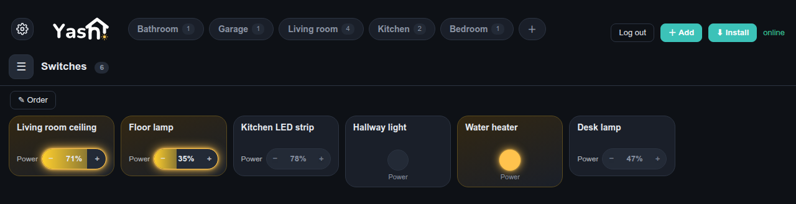
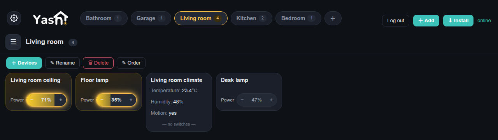
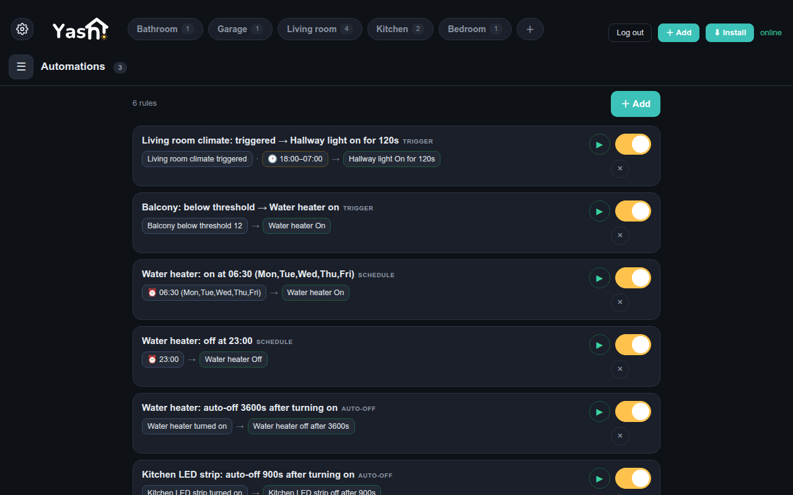
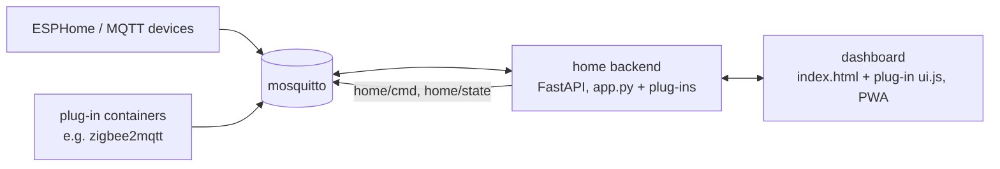
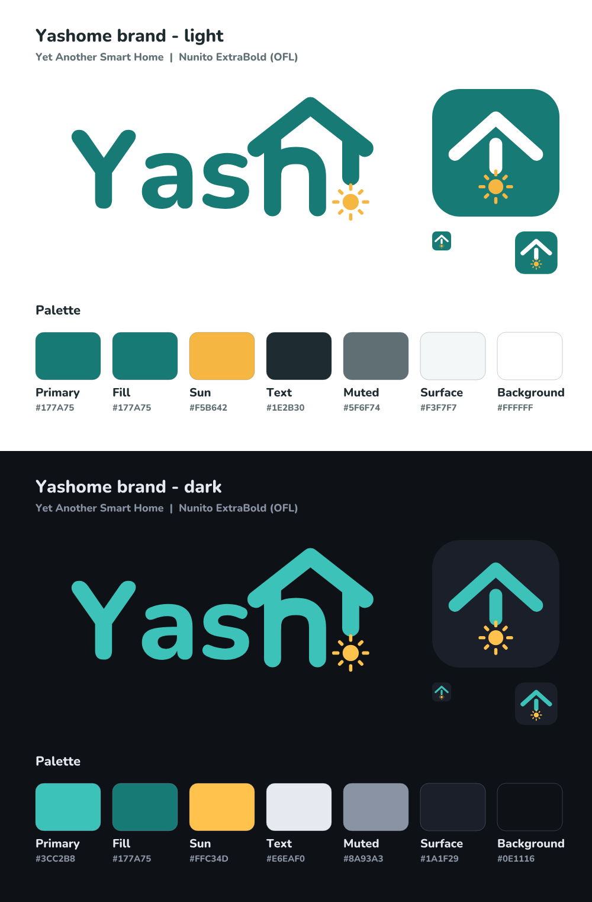

<p align="center"></p>

# Yashome -- Yet Another Smart Home

A small, local-only smart home: one Python backend, one HTML dashboard, MQTT in the middle.
Anything that speaks MQTT (ESPHome nodes, Tasmota, Shelly, your own firmware) is a few lines
of JSON. Everything else - Zigbee through zigbee2mqtt, TVs, IR blasters, cameras, a page of
your own - comes as a plug-in, with its own containers if it needs them. Nine plug-ins ship in
[`plugins/`](plugins/README.md); `.env` says which ones run.

No cloud, no accounts, no app store. The dashboard is a web page that installs as a PWA on a
phone or runs full-screen on any old tablet. Rules, schedules and auto-off timers are edited
in the same page.



## Why another one

| | Yashome | Home Assistant and friends |
|---|---|---|
| size | one `app.py`, one `index.html`, two containers (plus what your plug-ins bring) | a platform with thousands of integrations |
| how a device gets in | it publishes to MQTT; a plug-in adds whole families (Zigbee devices appear by themselves) | integration per vendor, config flow, YAML packages |
| automations | trigger, condition, action; schedule and auto-off per channel, all in the UI | scripts, blueprints, templates |
| what it takes to read the code | an evening | weeks |
| what it does not do | no vendor clouds, no voice assistants, no energy dashboards, no add-on store | everything |

If you already run Home Assistant and like it, keep it. This project is for people who want a
home they can read end to end, on a Raspberry Pi or an old laptop, with a broker they own.

## Features

- **Devices from MQTT.** Generic MQTT devices are declared in `mqtt_devices.json` with their
  state and command topics, or found through ESPHome's MQTT discovery ("Add" -> ESPHome).
- **Universal command bus.** Every device is reachable as `home/cmd/<device>/<code>` and
  reports on `home/state/<device>/<code>`, whatever it speaks underneath. Scripts and other
  tools only need this one contract.
- **Rules without code.** A rule is a trigger (device event, time, sensor threshold), optional
  conditions and actions. Per channel: schedules ("on at 06:00 on weekdays") and auto-off
  ("switch off 60 minutes after any on"), including a manual press.
- **Rooms and favourites.** The dashboard groups by room, keeps a favourites strip, shows live
  state over a WebSocket and re-syncs itself if the broker restarts.
- **Ids that can change.** When a device's id changes in its own system, every rule, favourite,
  room and timer that referenced it moves along (`POST /api/devices/relink`, or a plug-in's own
  rename such as Zigbee's).
- **PWA.** Installs on Android and desktop, works offline for the shell, full-screen on a wall
  tablet.
- **Token-gated API.** Everything under `/api` and `/ws` requires a bearer token; without one
  configured the backend refuses every request (fail closed).
- **Plug-ins.** Another transport, a vendor integration, a tab of its own: a Python package plus
  an optional `ui.js`, loaded at start, and optionally a `setup/` folder with its containers,
  broker account, secrets and install steps. Zigbee, weather, TVs, IR, cameras, NFC cards and more
  ship with the core; `PLUGINS` in `.env` switches them on. A broken plug-in is
  logged and skipped; the house keeps running.





## Quick start

### Requirements

Any Linux box that runs Docker: a Raspberry Pi 4 (2 GB is plenty), a NUC, an old laptop. On the
host you need only:

| package | why |
|---|---|
| `docker` + the `compose` plugin (v2.20 or newer) | the services run as containers; nothing else is installed on the host |
| `git`, `make` | to fetch the repository and run the four commands |
| `curl`, `openssl` | the installer generates secrets with them, the smoke test checks the backend |

Ubuntu 24.04+: `sudo apt install git make curl openssl docker.io docker-compose-v2`. Debian and
Raspberry Pi OS do not package the compose plugin: install `git make curl openssl` with apt and
Docker itself with `curl -fsSL https://get.docker.com | sh` (it brings the plugin). Then add
yourself to the docker group (`sudo usermod -aG docker $USER`, log out and in). Other distros:
[Docker's install guide](https://docs.docker.com/engine/install/). No web server, no Python,
no Node on the host: the backend and its dependencies live in the `home` image, the dashboard
is served by the backend itself. A reverse proxy (nginx, Caddy, Traefik) is optional and only
needed for HTTPS and access from outside the LAN, see `docs/security.md`.

A plug-in may need hardware of its own (the Zigbee plug-in: a coordinator stick); its
`setup/preflight.sh` checks for it during `make check`.

### Install

```sh
git clone https://github.com/freidkin-michael/yashome.git
cd yashome
make check       # can this host run it? docker, ports, and each plug-in's own checks
make install
```

`make install` writes `.env` for you, creates the broker accounts, starts the containers (the
broker, the backend and whatever your plug-ins bring) and prints the dashboard URL together
with the token to paste into it. It asks only what it cannot find out itself. Generic MQTT
devices go into `mqtt_devices.json`; `examples/` has a relay, a sensor and a dimmable lamp to
copy from; the example settings add rooms, a favourite and two schedules that start disabled.

### What `make install` does, and how to change it later

All settings live in one file, `.env`, and nothing else has to be edited to get a working
system. The installer fills it in like this:

1. **`DASHBOARD_TOKEN`** and **`MQTT_PASSWORD`** are generated with `openssl rand`. The token is
   printed once at the end; the broker password is never shown, `make secrets` writes it straight
   into the broker's account file (`config/mosquitto/dynamic-security.json`, hashes only).
2. **`TZ`** is the host's time zone; schedules run in it.
3. **`MQTT_HOST`**, **`DASHBOARD_PORT`** (8765) and the user name `home` are defaults; change the
   port if something on the host already uses it.
4. **`PLUGINS`** names the plug-ins that run (`zigbee,weather`, `*` = all). On the first install
   every plug-in whose `setup/detect.sh` finds its hardware is put there: with a USB stick in
   `/dev/serial/by-id/`, that is `zigbee` (the only one with a `detect.sh` today). Add others by hand; Settings -> Plug-ins lists what is
   off. **`PLUGINS_EXTRA_DIR`** (default `./plugins-extra`, git-ignored) is for plug-ins of your own.
5. **Each enabled plug-in's keys**: the ones in its `setup/env.example` that `.env` lacks are
   appended, then its `setup/install.sh` fills them (the Zigbee plug-in generates its broker
   password and frontend login and picks the coordinator stick).
6. Optional and empty by default: **`MQTT_DEVICE_USERS`** (broker accounts for your devices, each
   with `MQTT_<NAME>_PASSWORD`; they may do everything except write the `home/state` mirror,
   publish into a plug-in's bus it marks read-only for devices, or publish what
   **`MQTT_BACKEND_ONLY`** lists) and **`EXTRA_PIP`** (Python packages your plug-ins need,
   `name==version`, baked into the image by `make update`).
7. **`COMPOSE_FILE`** is written for you: `docker-compose.yml` plus every plug-in's
   `setup/compose.yml`, so a plain `docker compose ...` sees the plug-ins' containers too.

To change anything, edit `.env` and run `make update`: it re-derives the broker accounts and the
plug-ins' files from `.env`, rebuilds the backend image and lets compose recreate what changed
(the backend usually restarts, which takes a few seconds). The same command applies a new
version after `git pull`, and picks up a plug-in you added or removed. To rotate the dashboard
token, change it, `make update`, reload the page. The commands behind the installer, for a
manual setup or a different host:

```sh
openssl rand -hex 24                        # DASHBOARD_TOKEN
openssl rand -base64 18                     # each broker password
timedatectl show -p Timezone --value        # TZ
```

Nothing here is a Wi-Fi credential: the stack itself runs on the wired server. MQTT devices on
Wi-Fi carry their own Wi-Fi and broker credentials (ESPHome keeps them in its `secrets.yaml`).

Do not expose `:8765` to the internet directly. Put it behind a reverse proxy with TLS, and
preferably behind a VPN or an SSO portal; see `docs/security.md`.

## Architecture


```mermaid
flowchart LR
    E[ESPHome / MQTT devices] --> M[(mosquitto)]
    P[plug-in containers<br/>e.g. zigbee2mqtt] --> M
    M <--> H[home backend<br/>FastAPI, app.py + plug-ins]
    H <--> D[dashboard<br/>index.html + plug-in ui.js, PWA]
    H -- home/cmd, home/state --> M
```

Two containers of the core, plus the plug-ins' own:

| service | what | port |
|---|---|---|
| `mosquitto` | the broker; authenticated, one account per client kind | 1883 (LAN, `MQTT_PORT`) |
| `home` | backend + dashboard; config in JSON files next to it | 8765 (`DASHBOARD_PORT`) |
| a plug-in's, e.g. `zigbee2mqtt` | from the plug-in's `setup/compose.yml` | its own |

The backend keeps its configuration in `settings.json` (names, rooms, rules, favourites) and
`mqtt_devices.json` (generic devices), both plain JSON, both safe to edit by hand while the
stack is stopped. State lives in the broker as retained messages; the backend mirrors every
device into `home/state/...` so a script never needs to know the vendor topic.

A **plug-in** is a Python package (plus an optional `ui.js` and `i18n.json`) in `plugins/` of the
checkout, or of your own in `PLUGINS_EXTRA_DIR`, which compose mounts read-only into the `home`
container; `PLUGINS` in `.env` says which of them load. The core does not know any plug-in by
name; it offers hooks (transports and their rule shortcuts, MQTT topics and a namespace of its
own, rule actions, settings sections; on the dashboard tabs, the "Add" menu, card decorations or
whole card faces, a box in the header, a section of the device modal) and a plug-in registers
itself on them. A plug-in keeps its own files in `plugin-data/<name>/`, which git ignores: the
package holds code and empty templates, your house's data never lives in it. Settings ->
Plug-ins lists what loaded and what failed, with the error. Only a plug-in's `ui.js`,
`i18n.json` and `static/` files are served without the token; everything else it adds needs it.
To write one, start from `plugins/_example/` (copy it as `hello` into `PLUGINS_EXTRA_DIR`, add
`hello` to `PLUGINS`, `docker compose restart home`); the full contract is in
[docs/plugins.md](docs/plugins.md), the shipped ones are listed in [plugins/README.md](plugins/README.md).

Details: [MQTT contract](docs/mqtt-contract.md), [REST API](docs/rest-api.md),
[rules engine](docs/rules.md), [plug-ins](docs/plugins.md), [security model](docs/security.md).

## What it works with

- **Anything that already speaks MQTT** -- Tasmota, Shelly (MQTT mode), OpenBeken, ESPHome nodes
  with your own firmware, a script on a Raspberry Pi. You describe the topics once in
  `mqtt_devices.json` (see below) or let "Add" -> ESPHome read the node's MQTT discovery. Wi-Fi
  onboarding is the device's own business (Tasmota and Shelly have their setup portals, ESPHome
  its captive portal).
- **Zigbee** -- anything zigbee2mqtt supports, several thousand devices, through the `zigbee`
  plug-in: it brings the zigbee2mqtt container, pairing from "Add", renaming a device's key with
  every reference following, and removing it from the network.
- **Anything else you write a plug-in for** -- a device with its own protocol, a LAN API, a page
  of your own; see [docs/plugins.md](docs/plugins.md).
- **Not:** anything that lives behind a vendor cloud.

## Tested hardware

- **Server:** a small x86 box running Docker; a Raspberry Pi 4 is enough.
- **Zigbee (plug-in):** a Sonoff ZBDongle-E (EFR32MG21, zigbee2mqtt's `ember` adapter).

## Adding a generic MQTT device

Generic devices are described in **`mqtt_devices.json` in the repository root**, next to
`docker-compose.yml`; the `home` container sees it as `/app/mqtt_devices.json`. `make install`
creates it from `examples/mqtt_devices.json` if it does not exist, and the file is git-ignored,
so `git pull` never touches your devices. Its sibling `settings.json` (names, rooms, rules,
favourites) is written by the dashboard itself; you do not edit it by hand. One entry per
device:

```json
{
  "id": "boiler",
  "name": "Boiler",
  "category": "switch",
  "controls": [
    {"kind": "switch", "code": "power", "label": "Power",
     "state_topic": "boiler/relay/state", "command_topic": "boiler/relay/command",
     "payload_on": "ON", "payload_off": "OFF"}
  ]
}
```

Then `docker compose restart home` and the tile is there, with schedules and auto-off
available from its settings dialog. `examples/mqtt_devices.json` shows a sensor channel as well.

Where the values come from:

- **`id`** -- your own short name, Latin letters, digits and `_ . -`; it becomes part of the
  universal bus topics (`home/cmd/boiler/power`). Do not change it later, rules refer to it (if
  you must, `POST /api/devices/relink` moves them).
- **`name`** -- what the dashboard shows. Rooms are not a device field: put devices into rooms
  in the dashboard itself (the "+" chip next to the room names).
- **`category`** -- the dashboard tab: `switch`, `sensor`, `button`, `indicator`; anything
  else lands under "Other".
- **`code`** -- the channel name inside the device (`power`, `brightness`, `temperature`).
  A device may have several channels, one entry per channel. **`label`** is what the channel
  is called on the card.
- **`kind`** -- `switch` (on/off), `bright` (a level with `min`/`max`), `sensor` (a number or
  a `vtype: bool` yes/no to display), `sensor_text`, `setting_enum`.
- **`state_topic`**, **`command_topic`**, **`payload_on`/`payload_off`** -- from the device's
  documentation. Tasmota: `stat/<topic>/POWER` and `cmnd/<topic>/POWER` with `ON`/`OFF`; Shelly
  Gen1: `shellies/<id>/relay/0` and `.../relay/0/command` with `on`/`off`; ESPHome: whatever the
  node's `state_topic`/`command_topic` say. When in doubt, listen to the broker and press the
  physical button on the device: the topic that changes is the state topic.

  ```sh
  sed -n 's/^MQTT_PASSWORD=//p' .env | docker compose exec -T mosquitto sh -c \
      'f=$(mktemp); trap "rm -f $f" EXIT; printf -- "-P %s\n" "$(cat)" > "$f"; mosquitto_sub -o "$f" -u home -v -t "#"'
  ```

  Sensors need only `state_topic`; add `unit` (`%`, `W`, `\u00b0C` in JSON) for the display. A device may
  also publish one JSON object with all its values on a device-level `state_topic`; the full
  field list is in [docs/mqtt-contract.md](docs/mqtt-contract.md).

## Language

The dashboard is written in English; Russian ships as a dictionary in `i18n.js` and the
browser's language picks it (the gear button, Settings, switches and remembers). Adding a
language is one more table in that file - no Russian, or any other language, lives in the code.
A plug-in brings its own words in `i18n.json`; it can add words, never re-word the core's.

## Development

Four commands, in the order you will need them:

```sh
make check     # preflight: docker + compose, free ports, openssl, curl, your user in the
               # docker group, then each plug-in's setup/preflight.sh. Changes nothing.
make install   # first run: writes .env, creates broker accounts, starts everything
make test      # unit tests plus a smoke test against the running stack (broker reachable,
               # backend answers with the token, then each plug-in's setup/smoke.sh)
make update    # after editing .env, git pull or a plug-in change: re-derive secrets, rebuild, recreate
```

`make lint` (ruff, py_compile, JS syntax, JSON, `sh -n`, and `tools/check_plugins.py`: ASCII, no
LAN address, MAC or home directory in `plugins/`) and `make dev-test` (every test outside docker,
the core's and the plug-ins' in `tests/plugins/`) are what CI runs on every push. What changed in
each release is in [CHANGELOG.md](CHANGELOG.md).

The whole backend is `app.py`; the dashboard is `index.html`. Pull requests welcome, but read the code first: the point
of the project is that you can.

## Brand

The wordmark, icon and palette live in [`branding/`](branding/README.md) (Nunito, OFL); `branding/brand.py`
regenerates every asset. 

## License

MIT, see `LICENSE`.
